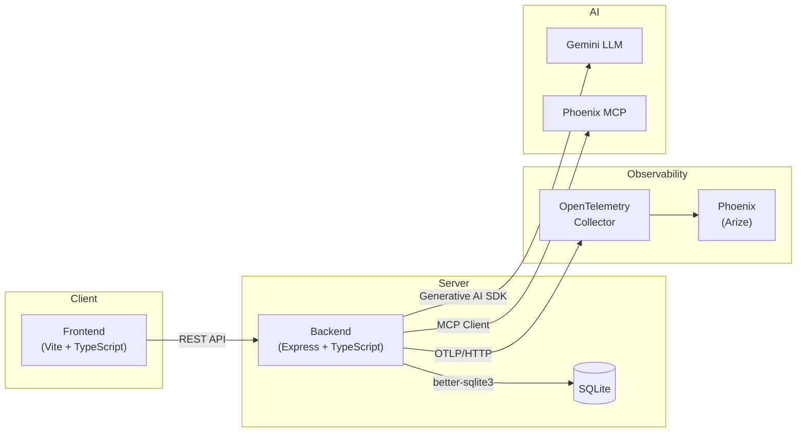

<p align="center">
  <h1 align="center">Reflexa</h1>
  <p align="center"><strong>Self-Improving Technical Interview Intelligence</strong></p>
</p>

<p align="center">
  <a href="#getting-started">Getting Started</a> •
  <a href="#architecture">Architecture</a> •
  <a href="#demo-walkthrough">Demo</a> •
  <a href="#testing">Testing</a> •
  <a href="#license">License</a>
</p>

---

Reflexa is an AI-powered interview preparation platform that continuously learns from every session to deliver sharper questions, more targeted feedback, and measurable improvement over time. It combines a Gemini-backed interview engine with an introspection agent that identifies failure patterns and rewrites its own strategy rules—so each session is smarter than the last.

## Architecture



Reflexa is organized as a **pnpm monorepo** with three workspace packages:

| Package             | Path                | Purpose                                                                                                          |
| ------------------- | ------------------- | ---------------------------------------------------------------------------------------------------------------- |
| `@reflexa/shared`   | `packages/shared`   | Zod schemas, TypeScript types, and API contracts — the single source of truth for data shapes across the stack   |
| `@reflexa/backend`  | `packages/backend`  | Express server with interview engine, introspection agent, SQLite persistence, and OpenTelemetry instrumentation |
| `@reflexa/frontend` | `packages/frontend` | Vite-powered SPA with session management, history views, comparative analytics, and live interview UI            |

## Tech Stack

| Technology                  | Role                                                                      |
| --------------------------- | ------------------------------------------------------------------------- |
| **TypeScript**              | End-to-end type safety across all packages                                |
| **Express.js**              | Backend HTTP server and REST API                                          |
| **Vite**                    | Frontend build tool and dev server                                        |
| **Gemini API**              | LLM powering interview question generation, evaluation, and introspection |
| **SQLite (better-sqlite3)** | Embedded database for sessions, rubrics, and strategy rules               |
| **OpenTelemetry**           | Distributed tracing and telemetry collection                              |
| **Phoenix (Arize)**         | LLM observability, trace visualization, and MCP integration               |
| **Zod**                     | Runtime schema validation and type inference                              |
| **pnpm workspaces**         | Monorepo dependency management and task orchestration                     |

## Environment Variables

| Variable                      | Required | Description                           |
| ----------------------------- | -------- | ------------------------------------- |
| `GOOGLE_API_KEY`              | Yes      | Gemini API key for LLM calls          |
| `PORT`                        | No       | Backend server port (default: `8000`) |
| `LOG_LEVEL`                   | No       | Pino log level (default: `info`)      |
| `OTEL_EXPORTER_OTLP_ENDPOINT` | No       | OpenTelemetry OTLP collector endpoint |

## Getting Started

### Prerequisites

- **Node.js** ≥ 18
- **pnpm** ≥ 8 — install via `npm install -g pnpm`
- A **Google AI / Gemini API key** — [get one here](https://aistudio.google.com/apikey)

### Setup

1. **Clone the repo**

   ```bash
   git clone https://github.com/your-org/reflexa.git
   cd reflexa
   ```

2. **Install dependencies**

   ```bash
   pnpm install
   ```

3. **Configure environment**

   ```bash
   cp packages/backend/.env.example packages/backend/.env
   ```

   Open `packages/backend/.env` and fill in your `GOOGLE_API_KEY`.

4. **Build the shared package**

   ```bash
   pnpm --filter @reflexa/shared build
   ```

5. **Seed demo data**

   ```bash
   npx ts-node packages/backend/src/seed.ts
   ```

6. **Start development servers**

   ```bash
   pnpm run dev
   ```

7. **Open the app**

   Navigate to [http://localhost:5173](http://localhost:5173) in your browser.

## Demo Walkthrough

Follow these five steps to see Reflexa's self-improvement loop in action:

### 1. 📋 Explore the Baseline

Open **History** to see the weak baseline session with a score of **42%**. This is the starting point — an interview where the agent used its default, untuned strategy.

### 2. 🔍 Inspect the Rubric

Click **Review** on the baseline session. You'll see the full rubric breakdown and **3 distinct failure patterns** the evaluation agent identified (e.g., missed edge cases, shallow follow-ups, vague scoring criteria).

### 3. 🧠 Read the Introspection Report

Navigate to the **Introspection Agent Report**. This is where Reflexa analyzed _what_ failed, _why_ it failed, and _what concrete changes_ to make. The agent auto-generates new strategy rules to address each weakness.

### 4. 📊 Compare Improvements

Click **Compare Previous** on the improved session (score: **71%**). See the **+29-point overall improvement** side-by-side, with per-rubric deltas showing exactly which areas recovered.

### 5. 🚀 Start a New Session

Launch a new interview session. The agent now incorporates the learned strategy rules — notice sharper questions, more targeted follow-ups, and stricter evaluation criteria.

## Testing

```bash
# Run the full test suite
pnpm test

# TypeScript type checking
pnpm run typecheck

# Lint with ESLint
pnpm run lint
```

## Project Structure

```
reflexa/
├── packages/
│   ├── shared/                  # @reflexa/shared
│   │   └── src/
│   │       ├── index.ts         # Package entry point
│   │       ├── schemas.ts       # Zod schemas (Session, Rubric, etc.)
│   │       └── contracts.ts     # API contract definitions
│   ├── backend/                 # @reflexa/backend
│   │   └── src/
│   │       ├── index.ts         # Express server, routes, interview engine
│   │       ├── seed.ts          # Demo data seeder
│   │       ├── telemetry.ts     # OpenTelemetry setup
│   │       ├── engine/          # Interview & introspection agents
│   │       └── state/           # SQLite persistence layer
│   └── frontend/                # @reflexa/frontend
│       └── src/
│           ├── main.ts          # App bootstrap
│           ├── shell.ts         # Application shell & layout
│           ├── router.ts        # Client-side routing
│           ├── api.ts           # Backend API client
│           ├── styles.css       # Global styles
│           ├── components/      # Reusable UI components
│           └── views/           # Page-level views
├── docs/                        # Documentation
│   └── CONTRACTS.md             # Human-readable API contracts
├── prompts/                     # LLM prompt templates
├── pnpm-workspace.yaml          # Workspace configuration
├── tsconfig.base.json           # Shared TypeScript config
├── vitest.config.ts             # Test configuration
└── package.json                 # Root scripts & devDependencies
```

## License

MIT
