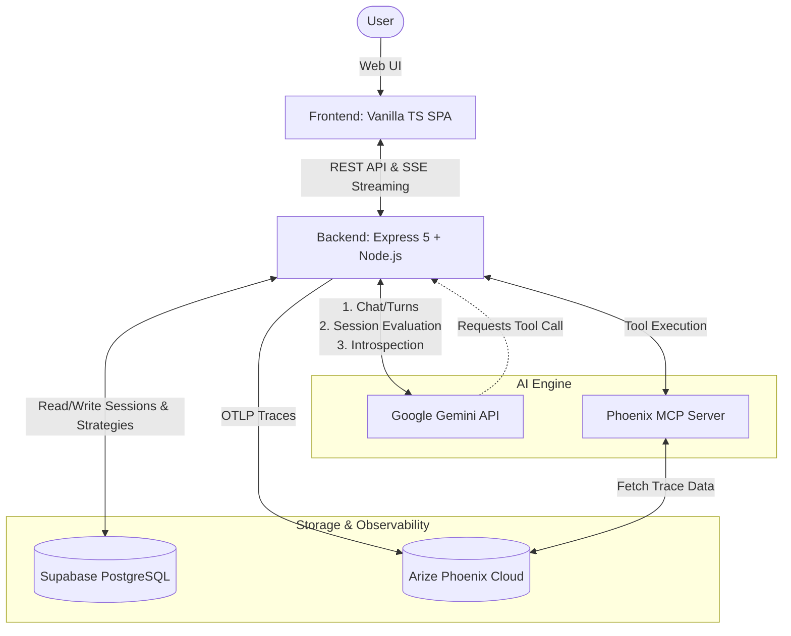

# Reflexa — Self-Improving AI Interview Agent

[](https://youtu.be/PLACEHOLDER)
[](./LICENSE)

<p align="center">
  <p align="center"><strong>Self-Improving Technical Interview Intelligence</strong></p>
</p>

<p align="center">
  <a href="#getting-started">Getting Started</a> •
  <a href="#architecture">Architecture</a> •
  <a href="#demo-walkthrough">Demo</a> •
  <a href="#testing">Testing</a> •
  <a href="#license">License</a>
</p>

---

Reflexa is an AI-powered interview preparation platform that continuously learns from every session to deliver sharper questions, more targeted feedback, and measurable improvement over time. It combines a Gemini-backed interview engine with an introspection agent that identifies failure patterns and rewrites its own strategy rules—so each session is smarter than the last.

### Key Technical Achievements

- **Adaptive LLM Routing:** Uses Gemini models for real-time chat (with Gemma fallback) and Gemma models for heavy analysis tasks (with Gemini fallback) to ensure 100% uptime and gracefully handle rate limits.
- **Serverless OpenTelemetry:** Implements manual trace flushing to bypass Cloud Run's aggressive CPU throttling, ensuring zero orphaned spans in Arize Phoenix.
- **Robust Cloud Stack:** Firebase Hosting for the lightning-fast frontend, Supabase for authentication and PostgreSQL state, and Google Cloud Run for serverless backend deployment.

## Architecture



Reflexa is a monorepo with three packages:

| Package             | Role                                                                                            |
| ------------------- | ----------------------------------------------------------------------------------------------- |
| `packages/backend`  | Express 5 + TypeScript API server. Supabase PostgreSQL persistence via `@supabase/supabase-js`. |
| `packages/frontend` | Vanilla TypeScript SPA (Vite). Interview UI, analysis dashboard, session history.               |
| `packages/shared`   | Shared Zod schemas and API contracts used by both packages.                                     |

### Data Stores

| Store                     | Purpose                                                                       |
| ------------------------- | ----------------------------------------------------------------------------- |
| **Supabase (PostgreSQL)** | Session state, evaluation results, strategy history                           |
| **Arize Phoenix Cloud**   | OpenTelemetry traces, LLM evaluation spans, MCP-accessible observability data |

### External Services

| Service             | Used for                                                    |
| ------------------- | ----------------------------------------------------------- |
| Google Gemini API   | Interview AI turns, evaluation scoring, introspection agent |
| Arize Phoenix Cloud | Trace ingestion, MCP server for self-reflection             |

## Tech Stack

| Layer            | Technology                                       |
| ---------------- | ------------------------------------------------ |
| AI Model         | Gemini 2.5 / Gemma (Adaptive Fallbacks)          |
| AI Observability | Arize Phoenix Cloud (OpenTelemetry + MCP)        |
| Backend          | Express 5, TypeScript, Node.js 22                |
| Database         | Supabase PostgreSQL                              |
| Auth             | Supabase OAuth (Google Sign-In)                  |
| Frontend         | Vanilla TypeScript, Vite 6, Tailwind CSS         |
| Instrumentation  | OpenInference + `@arizeai/phoenix-otel`          |
| Deployment       | Cloud Run (backend), Firebase Hosting (frontend) |

## Getting Started

### Prerequisites

- Node.js 22+
- pnpm 9+
- A [Firebase](https://firebase.google.com/) project for Frontend Hosting
- A [Supabase](https://supabase.com) project for PostgreSQL Database and Auth
- An [Arize Phoenix Cloud](https://app.phoenix.arize.com) account (free tier works)
- A [Google AI Studio](https://aistudio.google.com) API key

### 1. Clone repo

```bash
git clone https://github.com/your-org/reflexa
cd reflexa
```

### 2. Install deps (pnpm install)

```bash
pnpm install
```

### 3. Configure env vars

```bash
cp .env.example packages/backend/.env
# Edit packages/backend/.env and fill in all required values
```

See `.env.example` for descriptions of each variable.

### 4. Start services

Run the schema migration against your Supabase project using the dashboard SQL editor or `psql "$SUPABASE_URL" -f supabase/schema.sql`.

Then start the development servers:

```bash
# Terminal 1 — backend
cd packages/backend && pnpm dev

# Terminal 2 — frontend
cd packages/frontend && pnpm dev
```

### 5. Seed Demo Data

The demo walkthrough requires pre-built sessions to show the improvement arc.
After starting the backend for the first time, run:

```bash
cd packages/backend
pnpm seed
```

This creates:

- A **baseline session** (~42% score) with shallow answers and missed follow-ups
- An **improved session** (~71% score) after strategy updates were applied
- The strategy evolution entry connecting the two

> Re-run `pnpm seed --reset` to wipe and re-seed demo data at any time.

### 6. Open frontend

Frontend: http://localhost:5173  
Backend: http://localhost:8000

## Demo Walkthrough

1. Sign in with Google (OAuth via Supabase)
2. **Dashboard** — shows seeded baseline session at ~42% overall score
3. **Start a new session** — role: Senior Backend Engineer, difficulty: Hard
4. Complete 5–6 turns of interview
5. **End session** — triggers evaluation + introspection + strategy update
6. **Analysis page** — view rubric scores, study plan, and trace spans in Phoenix
7. **Strategy page** — evolution timeline shows rules generated from the weak session
8. **Start another session** — the new rules are injected into the system prompt
9. Complete the session — higher scores reflect strategy improvement

## Testing

```bash
# Run the full test suite
pnpm test

# TypeScript type checking
pnpm run typecheck

# Lint with ESLint
pnpm run lint
```

## Deployment

Reflexa uses Google Cloud Run for the backend and Firebase Hosting for the frontend.

### Backend (Cloud Run)

To automate deployment via Google Cloud Build:

1. Configure Google Cloud Secret Manager with your environment variables (`GOOGLE_API_KEY`, `ARIZE_API_KEY`, `ARIZE_SPACE_ID`, `SUPABASE_URL`, `SUPABASE_SERVICE_ROLE_KEY`).
2. Run the build command from the repository root:
   ```bash
   gcloud builds submit --config cloudbuild.yaml .
   ```

### Frontend (Firebase)

1. Build the Vite app: `cd packages/frontend && pnpm build`
2. Deploy via Firebase CLI: `firebase deploy --only hosting`

## Project Structure

```
reflexa/
├── packages/
│   ├── shared/                  # @reflexa/shared
│   │   └── src/
│   │       ├── index.ts         # Package entry point
│   │       ├── schemas.ts       # Zod schemas (Session, Rubric, etc.)
│   │       └── contracts.ts     # API contract definitions
│   ├── backend/                 # @reflexa/backend
│   │   └── src/
│   │       ├── index.ts         # Express server, routes, interview engine
│   │       ├── seed.ts          # Demo data seeder
│   │       ├── telemetry.ts     # OpenTelemetry setup
│   │       ├── engine/          # Interview & introspection agents
│   │       ├── state/           # Supabase persistence layer
│   └── frontend/                # @reflexa/frontend
│       └── src/
│           ├── main.ts          # App bootstrap
│           ├── shell.ts         # Application shell & layout
│           ├── router.ts        # Client-side routing
│           ├── api.ts           # Backend API client
│           ├── styles.css       # Global styles
│           ├── components/      # Reusable UI components
│           └── views/           # Page-level views
├── prompts/                     # LLM prompt templates
├── pnpm-workspace.yaml          # Workspace configuration
├── tsconfig.base.json           # Shared TypeScript config
├── vitest.config.ts             # Test configuration
└── package.json                 # Root scripts & devDependencies
```

## License

MIT
